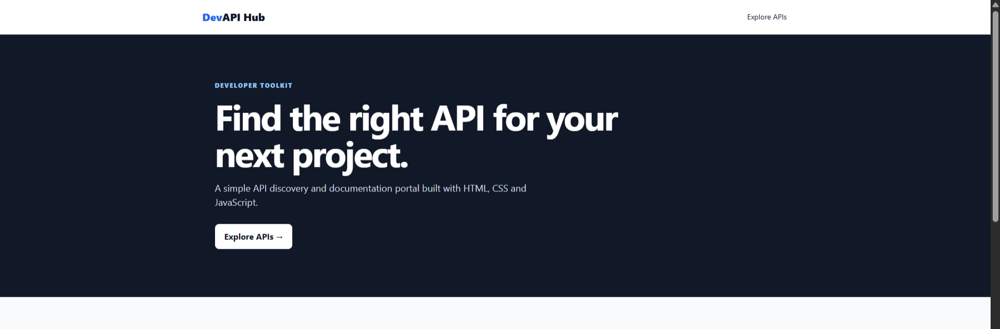
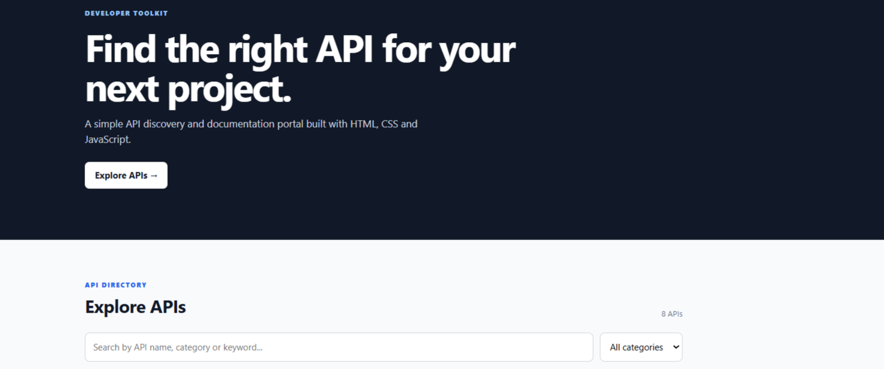
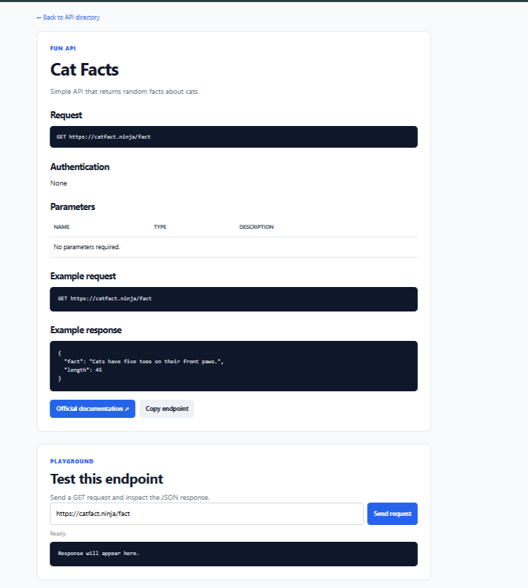

# DevAPI Hub

> A developer-focused API discovery, documentation and testing portal built with HTML, CSS and JavaScript.
>
> 


## Overview

DevAPI Hub is a simple web-based API discovery portal that helps developers find useful public APIs, explore their documentation, understand API endpoints, and test GET requests directly from the browser.

The project combines frontend development, REST API integration, API documentation, and developer-focused user experience in one application.

## Why I Built This

I wanted to build a practical project where I could learn how APIs are used from a developer's point of view.

Instead of only listing API names, I created documentation pages that provide the information a developer needs before using an API:

- API endpoint
- HTTP method
- Authentication
- Parameters
- Example request
- Example response
- Official documentation

I also added a small API playground so developers can test GET endpoints directly from the browser.

## Features

- Search APIs by name, category, or description
- Filter APIs by category
- Browse 8 curated public APIs
- Individual API documentation pages
- HTTP method information
- Authentication information
- Parameters table
- Example API requests
- Example JSON responses
- Official documentation links
- Browser-based GET API playground
- HTTP status display
- JSON response viewer
- Basic API error handling
- Copy endpoint functionality
- Responsive design

## APIs Included

| API | Category | Method | Authentication |
|---|---|---|---|
| Open-Meteo | Weather | GET | None |
| GitHub REST API | Developer | GET | Public endpoints |
| ExchangeRate API | Finance | GET | None for open endpoint |
| JSONPlaceholder | Developer | GET | None |
| Cat Facts | Fun | GET | None |
| Universities API | Education | GET | None |
| Random User API | Demo | GET | None |
| REST Countries | Public Data | GET | None |

## Screenshots

### Homepage



### API Directory



### API Documentation & Playground



## How It Works

The API information is stored as JavaScript objects.

The homepage uses JavaScript to dynamically display API cards.

Users can:

1. Search for an API.
2. Filter APIs by category.
3. Open an API documentation page.
4. Read the endpoint and usage information.
5. Test a GET endpoint using the API playground.
6. View the returned JSON response.

Each API documentation page contains:

- API description
- HTTP method
- Endpoint
- Authentication
- Parameters
- Example request
- Example response
- Official documentation link

## API Request Flow

```text
User
  |
  v
DevAPI Hub
  |
  v
Select an API
  |
  v
Read Documentation
  |
  v
API Endpoint
  |
  v
Fetch GET Request
  |
  v
API Server
  |
  v
JSON Response
  |
  v
Display Response
